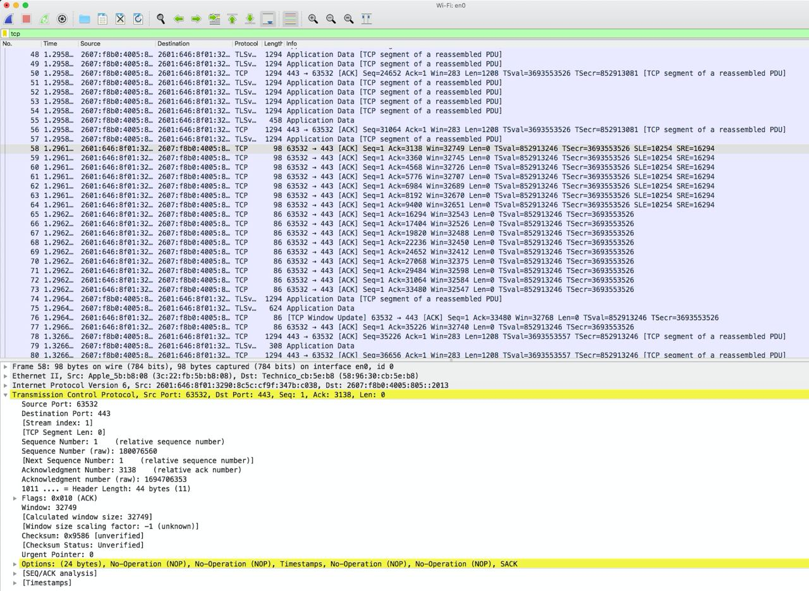

## Wireshark // TCP

Digging into the TCP protocol (for school) and for fun.

### How?

- Analyze a trace of TCP segments sent / received transferring a file.
- Look at some key things: slow start, congestion avoidance, flow control mechanism.
- Analyse throughput and round-trip time of the TCP connectio (between host and server)

Capturing TCP transfer data:
- Use wireshark to obtain a packet trace of the transfer
- Access web page / transfer using urllib POST

File used for this test: http://gaia.cs.umass.edu/wireshark-labs/alice.txt
Server used to transfer file to: http://gaia.cs.umass.edu/wireshark-labs/TCP-wireshark-file1.html

ACK Messages:

